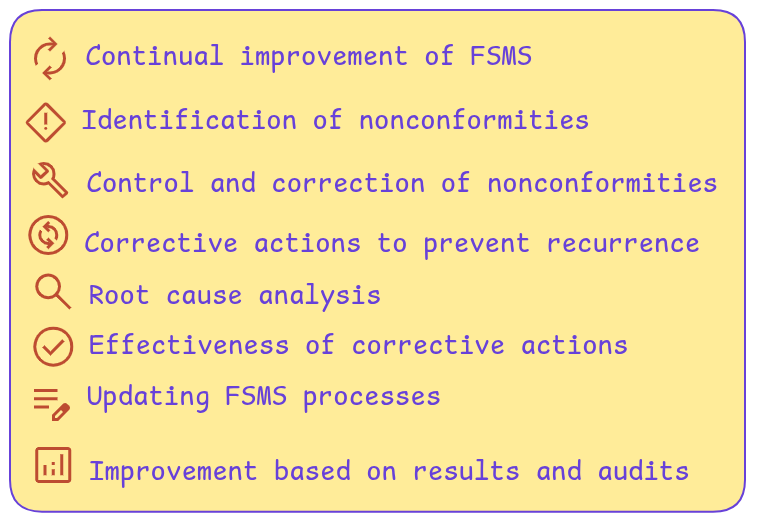

<a href="https://youtube.com/shorts/Qmqz1nub-TM">

  
Watch on YouTube.
</a> 
 

Clause 10 requires organizations to continually improve their Food Safety Management System.  
It involves identifying and managing nonconformities, taking corrective actions to prevent recurrence, and enhancing overall system effectiveness to ensure food safety is consistently maintained.  
Following points are covered in the standard.

1. ##### Nonconformity and corrective action

    ***1.1 When a nonconformity occurs, the organization shall:***

    a)react to the nonconformity and, as applicable:  
    1) take action to control and correct it;  
    2) deal with the consequences;  
    b) evaluate the need for action to eliminate the cause(s) of the nonconformity, in order that it does not   recur or occur elsewhere, by:  
    1) reviewing the nonconformity;  
    2) determining the causes of the nonconformity;  
    3) determining if similar nonconformities exist, or could potentially occur;  
    c) implement any action needed;  
    d) review the effectiveness of any corrective action taken;  
    e) make changes to the FSMS, if necessary.  
    Corrective actions shall be appropriate to the effects of the nonconformities encountered. 

    ***1.2 The organization shall retain documented information as evidence of:***

    a)the nature of the nonconformities and any subsequent actions taken;  
    b) the results of any corrective action.  

2. ##### Continual improvement

    The organization shall continually improve the suitability, adequacy and effectiveness of the FSMS.  
    Top management shall ensure that the organization continually improves the effectiveness of the FSMS  
    through the use of communication (see 7.4), management review (see 9.3), internal audit (see 9.2), analysis of results of verification activities (see 8.8.2), validation of control measure(s) and combination(s) of   control measure(s) (see 8.5.3), corrective actions (see 8.9.3) and FSMS updating (see 10.3).

3. ##### Update of the food safety management system

    Top management shall ensure that the FSMS is continually updated. To achieve this, the food safety team  shall evaluate the FSMS at planned intervals. The team shall consider whether it is necessary to review   the hazard analysis (see 8.5.2), the established hazard control plan (see 8.5.4) and the established PRPs
    (see 8.2).   
    The updating activities shall be based on:  
    a)input from communication, external as well as internal (see 7.4);   
    b) input from other information concerning the suitability, adequacy and effectiveness of the FSMS;   
    c)output from the analysis of results of verification activities (see 9.1.2);    
    d) output from management review (see 9.3).    
    System updating activities shall be retained as documented information and reported as input to the to the management review (see 9.3).
