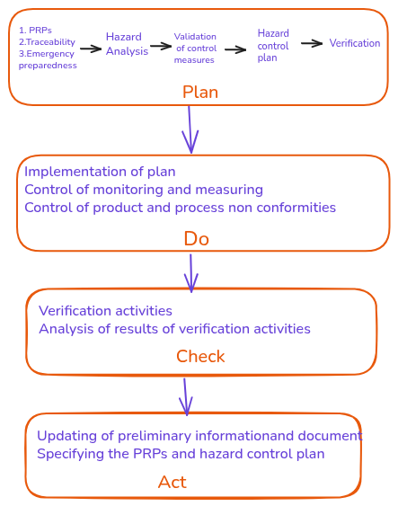

ISO 22000 establishes requirements for a Food Safety Management System to help organizations in the food chain identify and control food safety hazards, ensuring food is safe for consumption.   
It applies to all types and sizes of food-related businesses and combines communication, prerequisite programs, and HACCP principles within a management system aligned with ISO’s structure.   
The standard uses the PDCA approach to support continual improvement and consistent hazard control.
The key points as described in standard are given below.

1. ##### General 
The benefits of adopting this standard to organisations are
 - Ability to provide consistent food products and services
 - Addressing risk associated with objectives.      
 - the ability to demonstrate conformity to specified FSMS requirements.
 -  addressing risks associated with its objectives;
This standard  employs the process approach  which incorporates the Plan-Do-Check-Act
(PDCA) cycle . and risk-based thinking .
The PDCA cycle enables an organization to ensure that its processes are adequately resourced and managed, and that opportunities for improvement are determined and acted on.
Risk-based thinking enables an organization to determine the factors that could cause its processes and its FSMS to deviate from the planned results, and to put in place controls to prevent or minimize

2. ##### FSMS principles
Food safety is related to the presence of food safety hazards at the time of consumption (intake by the consumer). Food safety hazards can occur at any stage of the food chain. Therefore, adequate control throughout the food chain is essential. Food safety is ensured through the combined efforts of all the
parties in the food chain. This standard specifies the requirements for a FSMS that combines the following generally recognized key elements:
- interactive communication;
- system management;
- prerequisite programmes;
- hazard analysis and critical control point (HACCP) principles.
3. ##### Process Approach 
This standard  adopts a process approach when developing and implementing a FSMS and improving its effectiveness to enhance production of safe products and services while meeting applicable requirements.  The process approach
involves the systematic definition and management of processes, and their interactions, so as to achieve the intended results in accordance with the food safety policy and strategic direction of the organization. Management of the processes and the system as a whole can be achieved using the PDCA cycle, with an overall focus on risk-based thinking .
The recognition of the organization’s role and position within the food chain is essential to ensure effective interactive communication throughout the food chain.
Plan-Do-Check-Act cycle
The PDCA cycle can be described briefly as follows:
- Plan: establish the objectives of the system and its processes, provide the resources needed to deliver the results, and identify and address risks and opportunities;
- Do: implement what was planned;
- Check: monitor and (where relevant) measure processes and the resulting products and services,analyse and evaluate information and data from monitoring, measuring and verification activities, and report the results;
- Act:take actions to improve performance, as necessary.
In this standard PDCA cycle works at two levels.
 Overall pdca cycle and  PDCA cycle specific to clause 8 .
    <figure> 
    
    <figcaption> Overall PDCA </figcaption>
    </figure>
    - - - 
    <!--  -->
    <figure> 
    
    <figcaption> Operations PDCA </figcaption>
    </figure>