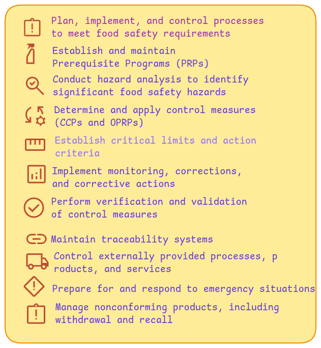

 

Clause 8 focuses on carrying out processes necessary to ensure safe food production.   
It includes hazard analysis, establishing PRPs, CCPs/OPRPs, implementing traceability, controlling outsourced processes, emergency preparedness, and managing nonconforming products to ensure food safety at every stage.    
Following points are described in standard.   

1. ##### Operational planning and control

    The organization shall plan, implement, control, maintain and update the processes needed to meet  requirements for the realization of safe products, and to implement the actions determined in  by:    
    a-  establishing criteria for the processes;  
    b- implementing control of the processes in accordance with the criteria;      
    c-keeping documented information to the extent necessary to have the confidence to demonstrate  that the processes have been carried out as planned.   
    The organization shall control planned changes and review the consequences of unintended changes, taking action to mitigate any adverse effects, as necessary.  
    The organization shall ensure that outsourced processes are controlled .

2. ##### Prerequisite programmes (PRPs)

    ***2.1 The organization shall establish, implement, maintain and update PRP(s)***

     to facilitate the   prevention and/or reduction of contaminants (including food safety hazards) in the products, product processing and work environment. 

    ***2.2 The PRP(s) shall be:***  

    a- appropriate to the organization and its context with regard to food safety;      
    b- appropriate to the size and type of the operation and the nature of the products being manufactured and/or handled;       
    c- implemented across the entire production system, either as programmes applicable in general or as programmes applicable to a particular product or process;       
    d- approved by the food safety team.   

    ***2.3 When selecting and/or establishing PRP(s)***

    the organization shall ensure that applicable  statutory, regulatory and mutually agreed customer requirements are identified.      
    The organization should consider:     
    a- the applicable part of the ISO/TS 22002 series;  
    b- applicable standards, codes of practice and guidelines.  
    
    ***2.4 When establishing PRP(s)- the organization shall consider:***

    a-construction, lay-out of buildings and associated utilities;  
     b- lay-out of premises, including zoning, workspace and employee facilities;    
    c-supplies of air, water, energy and other utilities;  
    d- pest control, waste and sewage disposal and supporting services;  
    e-the suitability of equipment and its accessibility for cleaning and maintenance;            
    f-  supplier approval and assurance processes (e.g. raw materials, ingredients, chemicals and  packaging-);    
    g- reception of incoming materials, storage, dispatch, transportation and handling of products;    
    h- measures for the prevention of cross contamination;    
    i- cleaning and disinfecting;    
    j-personal hygiene;    
    k- product information/consumer awareness;    
    l-others, as appropriate.    
       
    Documented information shall specify the selection, establishment  applicable monitoring and verification of the PRP(s).

3. ##### Traceability system

    The traceability system shall be able to uniquely identify incoming material from the suppliers and  the first stage of the distribution route of the end product.   
    When establishing and implementing the traceability system, the following shall be considered as a minimum: 

    a-relation of lots of received materials, ingredients and intermediate 
    products to the end products;
    b- reworking of materials/products;
    c-distribution of the end product.
   
    The organization shall ensure that applicable statutory, regulatory and customer requirements are  identified.

    Documented information as evidence of the traceability system shall be retained for a defined period   to include, as a minimum, the shelf life of the product.   
    The organization shall verify and test the  effectiveness of the taceability system.   
    
    NOTE  
    Where appropriate, the verification of the system is expected to include the reconciliation of quantities of end products with the quantity of ingredients as evidence of effectiveness.

4. ##### Emergency preparedness and response

    ***4.1 General***
        
    Top management shall ensure procedures are in place to respond to potential emergency situations or  incidents that can have an impact on food safety which are relevant to the role of the organization in the  food chain.  
    Documented information shall be established and maintained to manage these situations and incidents. 
       
    ***4.2 Handling of emergencies and incidents***

    The organization shall:    

    a- respond to actual emergency situations and incidents by:  
    1- ensuring applicable statutory and regulatory requirements are identified;   
    2- communicating internally;   
    3- communicating externally (e.g. suppliers, customers, appropriate authorities, media-;   

    b- take action to reduce the consequences of the emergency situation, appropriate to the magnitude of  the emergency or incident and the potential food safety impact;   
    c-periodically test procedures where practical;   
    d- review and, where necessary, update the documented information after the occurrence of any incident, emergency situation or tests.  
    
    NOTE:  
    Examples of emergency situations that can affect food safety and/or production are natural disasters,
    environmental accidents, bioterrorism, workplace accidents, public health emergencies and other accidents, e.g.
    interruption of essential services such as water, electricity or refrigeration supply.

5. ##### Hazard control

    ***5.1 Preliminary steps to enable hazard analysis***
    
    *5.1.1 General*
        
    To carry out the hazard analysis, preliminary documented information shall be collected, maintained
    and updated by the food safety team. This shall include, but not be limited to:
    a-applicable statutory, regulatory and customer requirements;
    b- the organization’s products, processes 
    c-food safety hazards relevant to the FSMS.

    *5.1.2 Characteristics of raw materials, ingredients and product contact materials*   
        
    The organization shall ensure that all applicable statutory and regulatory food safety requirements are
    identified for all raw materials, ingredients and product contact materials.

    The organization shall maintain documented information concerning all raw materials, ingredients   and product contact materials to the extent needed to conduct the hazard analysis , including
    the following, as appropriate: 

    a)biological, chemical and physical characteristics; 
    b) composition of formulated ingredients, including additives and processing aids;   
    c)source (e.g. animal, mineral or vegetable);  
    e)method of production;        
    d) place of origin (provenance);  
    f) method of packaging and delivery;  
    g) storage conditions and shelf life;  
    h) preparation and/or handling before use or processing;  
    i) acceptance criteria related to food safety or specifications of purchased materials and ingredients appropriate to their intended use.  

    *5.1.3 Characteristics of end products*  

    The organization shall ensure that all applicable statutory and regulatory food safety requirements are  identified for all the end products intended to be produced.  
    The organization shall maintain documented information concerning the characteristics of end  products to the extent needed to conduct the hazard analysis ., including information on the following, as appropriate:    
    a)product name or similar identification;    
    b) composition;    
    c)biological, chemical and physical characteristics relevant for food   safety;    
    e)packaging;      
    d) intended shelf life and storage conditions;    
    f)labelling relating to food safety and/or instructions for handling,   preparation and intended use;    
    g) method(s) of distribution and delivery.    
   
    *5.1.4 Intended use*   
    
    The intended use, including reasonably expected handling of the end product and any unintended use  but reasonably expected mishandling and misuse of the end product, shall be considered and shall be  Where appropriate, groups of consumers/users shall be identified for each product.    
    Groups of consumers/users known to be especially vulnerable to specific food safety hazards shall be identified.

    
    *5.1.5 Flow diagrams and description of processes*
   
    *Preparation of the flow diagrams*  

    The food safety team shall establish, maintain and update flow diagrams as documented information for the products or product categories and the processes covered by the FSMS.   
    Flow diagrams provide a graphic representation of the process. Flow diagrams shall be used when  conducting the hazard analysis as a basis for evaluating the possible occurrence, increase, decrease or introduction of food safety hazards.  
    Flow diagrams shall be clear, accurate and sufficiently detailed to the extent needed to conduct the hazard analysis.    
    Flow diagrams shall, as appropriate, include the following:  
    a)the sequence and interaction of the steps in the operation;
    b) any outsourced processes;    
    d) where reworking and recycling take place;   
    c)where raw materials, ingredients, processing aids, packaging materials, utilities and intermediate products enter the flow;    
    e)where end products, intermediate products, by-products and waste are released or removed.
       
    *On-site confirmation of flow diagrams*
    
    The food safety team shall confirm on-site the accuracy of the flow diagrams, update the flow diagrams   where appropriate and retain as documented information.
    
    *Description of processes and process environment*

    The food safety team shall describe, to the extent needed to conduct the hazard analysis:
    a)the layout of premises, including food and non-food handling areas;
    b) processing equipment and contact materials, processing aids and flow of materials;
    c)existing PRPs, process parameters, control measures (if any) and/or the strictness with which they  are applied, or procedures that can influence food safety;   
    d) external requirements (e.g. from statutory and regulatory authorities or customers) that can
    impact the choice and the strictness of the control measures.
    The variations resulting from expected seasonal changes or shift patterns shall be included as
    appropriate.
    The descriptions shall be updated as appropriate and maintained as documented information.
   
    ***5.2 Hazard analysis***
    
    *5.2.1 General*  
    The food safety team shall conduct a hazard analysis, based on the preliminary information, to  determine the hazards that need to be controlled. The degree of control shall ensure food safety and,
    where appropriate, a combination of control measures shall be used
    
    *5.2.2 Hazard identification and determination of acceptable levels*

    The organization shall identify and document all food safety hazards that are reasonably  expected to occur in relation to the type of product, type of process and process environment.    
    The identification shall be based on:  
    a)the preliminary information and data collected .  
    c)internal and external information including, to the extent possible, epidemiological, scientific and other historical data;   
    e)statutory, regulatory and customer requirements.    
    b) experience;    
    d) information from the food chain on food safety hazards related to the safety of the end products,  
    intermediate products and the food at the time of consumption;  
    NOTE 1
    Experience can include information from staff and external experts who are familiar with the product   and/or processes in other facilities.
    NOTE 2
    Statutory and regulatory requirements can include food safety objectives (FSOs). The Codex  Alimentarius Commission defines FSOs as “The maximum frequency and/or concentration of a hazard in a food  at the time of consumption that provides or contributes to the appropriate level of protection (ALOP)”.  
    Hazards should be considered in sufficient detail to enable hazard assessment and the selection of  appropriate control measures.  
    
    The organization shall identify step(s) (e.g. receiving raw materials, processing, distribution
    and delivery) at which each food safety hazard can be present, be introduced, increase or persist.

    When identifying hazards, the organization shall consider:    
    a)the stages preceding and following in the food chain;    
    b) all steps in the flow diagram;  
    c)the process equipment, utilities/services, process environment and persons.    
   
    The organization shall determine the acceptable level in the end product of each food safety  hazard identified, whenever possible.  
    When determining acceptable levels, the organization shall:  
    a)ensure that applicable statutory, regulatory and customer requirements are identified;  
    b) consider the intended use of end products;  
    c)consider any other relevant information.  
   
    The organization shall maintain documented information concerning the determination of acceptable  levels and the justification for the acceptable levels.
    
    *5.2.3 Hazard assessment*

    The organization shall conduct, for each identified food safety hazard, a hazard assessment to determine  whether its prevention or reduction to an acceptable level is essential.   
    The organization shall evaluate each food safety hazard with regard to:
    a) the likelihood of its occurrence in the end product prior to application of control measures;
    b) the severity of its adverse health effects in relation to the intended use.   
    The organization shall identify any significant food safety hazards.  
    The methodology used shall be described, and the result of the hazard assessment shall be maintained as documented information.
   
    *5.2.4 Selection and categorization of control measure(s)*

    Based on the hazard assessment, the organization shall select an appropriate control  measure or combination of control measures that will be capable of preventing or reducing the identified  significant food safety hazards to defined acceptable levels.  
    The organization shall categorize the selected identified control measure(s) to be managed as OPRP(s)  or at CCPs .
    The categorization shall be carried out using a systematic approach. For each of the control measures  selected, there shall be an assessment of the following:
    a) the likelihood of failure of its functioning;
    b) the severity of the consequence in the case of failure of its functioning; this assessment shall   include:
    1) the effect on identified significant food safety hazards;
    2) the location in relation to other control measure(s);
    3) whether it is specifically established and applied to reduce the hazards to an acceptable level;
    4) whether it is a single measure or is part of combination of control measure(s).
   
    In addition, for each control measure, the systematic approach shall include an assessment of  the feasibility of:  
    
    a)establishing measurable critical limits and/or measurable/observable 
    action criteria;
    b) monitoring to detect any failure to remain within critical limit and/or measurable/observable
    c)applying timely corrections in case of failure.
   
    action criteria;
    
    The decision-making process and results of the selection and categorization of the control measures   shall be maintained as documented information.
    External requirements (e.g. statutory, regulatory and customer requirements) that can impact the  choice and the strictness of the control measures shall also be maintained as documented information.
    
    
    ***5.3 Validation of control measure(s) and combinations of control measures***
    
    The food safety team shall validate that the selected control measures are capable of achieving the intended control of the significant food safety hazard(s). This validation shall be done prior to   implementation of control measure(s) and combinations of control measures to be included in the   hazard control plan .(see 8.5.4) and after any change therein (see 7.4.2, 7.4.3, 10.2 and 10.3).     
    When the result of validation shows that the control measures(s) is (are) not capable of achieving  the intended control, the food safety team shall modify and  The food safety team shall maintain the validation methodology and evidence of capability of the   control measure(s) to achieve the intended control as documented information.
    NOTE
    Modification can include changes in control measure(s) (i.e. process parameters, rigour and/or their   combination) and/or change(s) in the manufacturing technologies for raw materials, end product characteristics,
    methods of distribution and intended use of the end products.
    
    ***5.4 Hazard control plan (HACCP/OPRP plan)***
    
    *5.4.1 General* 

    The organization shall establish, implement and maintain a hazard control plan. The hazard control 
    plan shall be maintained as documented information and shall include the following information for  each control measure at each CCP or OPRP:  
    a)food safety hazard(s) to be controlled at the CCP or by the OPRP;  
    b) critical limit(s) at CCP or action criteria for OPRP;  
    c)monitoring procedure(s);  
    d) correction(s) to be made if critical limits or action criteria are not met;
    e)responsibilities and authorities;     
    f)records of monitoring.   
    
    *5.4.2 Determination of critical limits and action criteria*
    
    Critical limits at CCPs and action criteria for OPRPs shall be specified. The rationale for their  determination shall be maintained as documented information.  
    Critical limits at CCPs shall be measurable. Conformance with critical limits shall ensure that the acceptable level is not exceeded.  
    Action criteria for OPRPs shall be measurable or observable. Conformance with action criteria shall contribute to the assurance that the acceptable level is not exceeded.   

    *5.4.3 Monitoring systems at CCPs and for OPRPs*

    At each CCP, a monitoring system shall be established for each control measure or combination of control measure(s) to detect any failure to remain within the critical limits.   
    The system shall include all  scheduled measurements relative to the critical limit(s).  
    For each OPRP, a monitoring system shall be established for the control measure or combination of control measure(s) to detect failure to meet the action criterion.  
    The monitoring system, at each CCP and for each OPRP, shall consist of documented information, including:   
    a)measurements or observations that provide results within an adequate time frame;
    b) monitoring methods or devices used;
    c)applicable calibration methods or, for OPRPs, equivalent methods for verification of reliable
    measurements or observations (see 8.7);
    d) monitoring frequency;    
    e)monitoring results;    
    
    responsibility and authority related to monitoring;
    responsibility and authority related to evaluation of monitoring results.
    At each CCP, the monitoring method and frequency shall be capable of timely detection of any failure to  remain within critical limits, to allow timely isolation and evaluation of the product (see 8.9.4).  
    For each OPRP, the monitoring method and frequency shall be proportionate to the likelihood of failure   and the severity of consequences.  
    When monitoring an OPRP is based on subjective data from observations (e.g. visual inspection), the   method shall be supported by instructions or specifications.   
    
    *5.4.4 Actions when critical limits or action criteria are not met*

    The organization shall specify corrections (see 8.9.2) and corrective actions (see 8.9.3) to be taken  when critical limits or action criterion are not met and shall ensure that:    
    a)the potentially unsafe products are not released (see 8.9.4);
    b)the cause of nonconformity is identified;
    c)the parameter(s) controlled at the CCP or by the OPRP is (are) returned within the critical limits or action criteria;   
    d) recurrence is prevented.    
    The organization shall make corrections in accordance with 8.9.2 and corrective actions in accordance  with 8.9.3.
    
    *5.4.5 Implementation of the hazard control plan*
    
    The organization shall implement and maintain the hazard control plan, and retain evidence of the  implementation as documented information.

6. ##### Updating the information specifying the PRPs and the hazard control plan

    Following the establishment of the hazard control plan, the organization shall update the following  information, if necessary:  
    a)characteristics of raw materials, ingredients and product-contact materials;  
    b) characteristics of end products;    
    c)intended use;    
    d) flow diagrams and descriptions of processes and process environment.
    The organization shall ensure that the hazard control plan and/or the PRP(s) are up to date.  

7. ##### Control of monitoring and measuring

    The organization shall provide evidence that the specified monitoring and measuring methods and  equipment in use are adequate for the monitoring and measuring activities related to the PRP(s) and
    the hazard control plan.  
    The monitoring and measuring equipment used shall be:    
    a)calibrated or verified at specified intervals prior to use;  
    b) adjusted or re-adjusted as necessary;  
    c)identified to enable the calibration status to be determined;  
    d) safeguarded from adjustments that would invalidate the measurement results;    
    e) protected from damage and deterioration.  
    The results of calibration and verification shall be retained as documented information.  
    The calibration  of all the equipment shall be traceable to international or national measurement standards; where no standards exist, the basis used for calibration or verification shall be retained as documented
    information.  
    The organization shall assess the validity of the previous measurement results when the equipment or  process environment is found not to conform to requirements.   
    The organization shall take appropriate  action in relation to the equipment or process environment and any product affected by the non-
    conformance.  
    The assessment and resulting action shall be maintained as documented information.  
    Software used in monitoring and measuring within the FSMS shall be validated by the organization,  software supplier or third party prior to use.   
    Documented information on validation activities shall be
    maintained by the organization and the software shall be updated in a timely manner.
    Whenever there are changes, including software configuration/modifications to commercial off-the-
    shelf software, they shall be authorized, documented and validated before implementation.
    NOTE
    Commercial off-the-shelf software in general use within its designed application range can be
    considered to be sufficiently validated.

8. ##### Verification related to PRPs and the hazard control plan

    
    ***8.1. Verification***

    The organization shall establish, implement and maintain verification activities.   
    The verification  planning shall define purpose, methods, frequencies and responsibilities for the verification activities.    
    The verification activities shall confirm that: 
    a)the PRP(s) are implemented and effective; 
    b) the hazard control plan is implemented and effective;     
    c)hazard levels are within identified acceptable levels;   
    d) input to the hazard analysis is updated;     
    e)other actions determined by the organization are implemented and efftive.   
    
    
    The organization shall ensure that verification activities are not carried out by the person responsible  for monitoring the same activities.    
    Verification results shall be retained as documented information and shall be communicated.    
    Where verification is based on testing of end product samples or direct process samples and where   such test samples show nonconformity with the acceptable level of the food safety hazard (see 8.5.2.2),  
    the organization shall handle the affected lot(s) of product as potentially unsafe (see 8.9.4.3) and apply  corrective actions in accordance with 8.9.3.
     
    ***8.2 Analysis of results of verification activities***

    The food safety team shall conduct an analysis of the results of verification that shall be used as an input to the performance evaluation of the FSMS (see 9.1.2).

9. ##### Control of product and process nonconformities
  
    ***9.1 General***

    The organization shall ensure that data derived from the monitoring of OPRPs and at CCPs are evaluated by designated persons who are competent and have the authority to initiate corrections and corrective actions.
    
    ***9.2 Corrections***

    The organization shall ensure that when critical limits at CCP(s) and/or action criteria for  OPRPs are not met, the products affected are identified and controlled with regard to their use and release.  
    The organization shall establish, maintain and update documented information that includes:  
    a) a method of identification, assessment and correction for affected products to ensure their proper handling;  
    b) arrangements for review of the corrections carried out.  
    When critical limits at CCPs are not met, affected products shall be identified and handled as potentially unsafe products (see 8.9.4).  
    
    Where action criteria for an OPRP are not met, the following shall be carried out:  
    
    a)determination of the consequences of that failure with respect to food safety; 
    b) determination of the cause(s) of failure;   
    c)identification of the affected products and handling in accordance with 8.9.4    
     
    The organization shall retain results of the evaluation as documented information.   
    Documented information shall be retained to describe corrections made on nonconforming  roducts and processes, including:  
    a)the nature of the nonconformity; 
    b) the cause(s) of the failure;   
    c)the consequences as a result of the nonconformity.  
       
    ***9.3 Corrective actions***

    The need for corrective actions shall be evaluated when critical limits at CCP(s) and/or action criteria for OPRPs are not met.  
    The organization shall establish and maintain documented information that specifies appropriate  actions to identify and eliminate the cause of detected nonconformities, to prevent recurrence, and to return the process to control after a nonconformity is identified.   
    These actions shall include:  
    a)reviewing nonconformities identified by customer and/or consumer complaints and/or regulatory inspection reports;  
    b) reviewing trends in monitoring results that can indicate loss of control;  
    c)determining the cause(s) of nonconformities;   
    d) determining and implementing actions to ensure that nonconformities do not recur;  
    e) documenting the results of corrective actions taken;    
    f)verifying corrective actions taken to ensure that they are effective.    
      
    The organization shall retain documented information on all corrective actions.
    
    ***9.4 Handling of potentially unsafe products***
    
    *9.4.1 General* 

    The organization shall take action(s) to prevent potentially unsafe products from entering the food  chain, unless it can demonstrate that:    
    a)the food safety hazard(s) of concern is (are) reduced to the defined acceptable levels;   
    b) the food safety hazard(s) of concern will be reduced to identified acceptable levels prior to entering the food chain or,  
    c)the product still meets the defined acceptable level(s) of the food safety hazard(s) of concern despite the nonconformity.  
    The organization shall retain products that have been identified as potentially unsafe under its control until the products have been evaluated and the disposition has been determined.  
    If products that have left the control of the organization are subsequently determined to be unsafe, the organization shall notify relevant interested parties and initiate a withdrawal/recall (see 8.9.5).   
    The controls and related responses from relevant interested parties and authorization for dealing with potentially unsafe products shall be retained as documented information.   
    
    *9.4.2 Evaluation for release*

    Each lot of products affected by the nonconformity shall be evaluated.  
    Products affected by failure to remain within critical limits at CCPs shall not be released, but shall be  handled in accordance with 8.9.4.3.  
    Products affected by failure to meet action criterion for OPRPs shall only be released as safe when any  of the following conditions apply:  
    a)evidence other than the monitoring system demonstrates that the control measures have been  effective;  
    b) evidence shows that the combined effect of the control measures for that particular product conforms to the performance intended (i.e. identified acceptable levels);   
    Results of evaluation for release of products shall be retained as documented information.  
    c)the results of sampling, analysis and/or other verification activities demonstrate that the affected products conform to the identified acceptable levels for the food safety hazard(s) concerned.   
        
    *9.4.5 Disposition of nonconforming products*

    Products that are not acceptable for release shall be:
    a)  reprocessed or further processed within or outside the organization to ensure that the food safety   hazard is reduced to acceptable levels; or  
    b) redirected for other use as long as food safety in the food chain is not affected; or destroyed and/or disposed as waste.  
    Documented information on the disposition of nonconforming products, including the identification of  the person(s) with approving authority shall be retained.
   
     ***9.5 Withdrawal/recall***

    The organization shall be able to ensure the timely withdrawal/recall of lots of end products that have  been identified as potentially unsafe, by appointing competent person(s) having the authority to initiate  and carry out the withdrawal/recall.  
    The organization shall establish and maintain documented information for:  
    a)notifying relevant interested parties (e.g. statutory and regulatory authorities, customers and/or  consumers);
    b) handling withdrawn/recalled products as well as products still in stock;
    c)performing the sequence of actions to be taken.
    
    Withdrawn/recalled products and end products still in stock shall be secured or held under the control of the organization until they are managed in accordance with 8.9.4.3.     
    The cause, extent and result of a withdrawal/recall shall be retained as documented information and  reported to the top management as input for the management review (see 9.3).   
    The organization shall verify the implementation and effectiveness of withdrawals/recalls through the  use of appropriate techniques (e.g. mock withdrawal/recall or practice withdrawal/recall) and retain documented information.