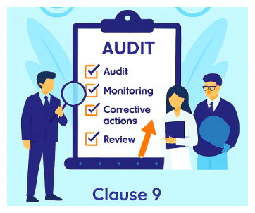

 
This clause focuses on reviewing how well the Food Safety Management System is performing.   
It requires monitoring, measurement, analysis, and evaluation of food safety processes.  
Organizations must conduct internal audits, management reviews, and assess system effectiveness based on documented data, trends, and performance results to ensure continual compliance and improvement.  
Following are the points covered in the standard.  

1. ##### Monitoring, measurement, analysis and evaluation

   ***1.1 General***

   The organization shall determine:  
   a) what needs to be monitored and measured;  
   b)the methods for monitoring, measurement, analysis and evaluation, as applicable, to ensure valid results;  
   c)when the monitoring and measuring shall be performed;  
   e)who shall analyse and evaluate the results from monitoring and measurement.  
   d) when the results from monitoring and measurement shall be analysed and evaluated;  
	The organization shall retain appropriate documented information as evidence of the results.  
   The organization shall evaluate the performance and the effectiveness of the FSMS.

   ***1.2. Analysis and evaluation***

    The organization shall analyse and evaluate appropriate data and information arising from monitoring and measurement, including the results of verification activities related to PRPs and the hazard control.   
    The analysis shall be carried out:    
    a)to confirm that the overall performance of the system meets the planned arrangements and the FSMS requirements established by the organization;      
    b) to identify the need for updating or improving the FSMS;    
    c)to identify trends which indicate a higher incidence of potentially unsafe products or process failures;    
    d) to establish information for planning of the internal audit programme related to the status and importance of areas to be audited;  
    e)to provide evidence that corrections and corrective actions are effective.  
    The results of the analysis and the resulting activities shall be retained as documented information.   
    The results shall be reported to top management and used as input to the management review (see 9.3) and the updating of the FSMS (see 10.3).    
    NOTE    
    Methods to analyse data can include statistical techniques.    

2. ##### Internal audit

   *** 2.1 The organization shall conduct internal audits at planned intervals to provide information on whether the FSMS:***

   a)conforms to:    
   1 the organization’s own requirements for its FSMS;  
   2 the requirements of this document;    
   b) is effectively implemented and maintained.    
   ***2.2The organization shall:***  

   a)plan, establish, implement and maintain (an) audit programme(s), including the frequency, methods,responsibilities, planning requirements and reporting, which shall take into consideration the importance of the processes concerned, changes in the FSMS, and the results of monitoring,measurement and previous audits;      
   b) define the audit criteria and scope for each audit;    
   c)select competent auditors and conduct audits to ensure objectivity and the impartiality of the audit process;   
   d) ensure that the results of the audits are reported to the food safety team and relevant management;  
   e)retain documented information as evidence of the implementation of the audit programme and the audit results;  
   f)make the necessary correction and take the necessary corrective action within the agreed time frame;  
   g) determine if the FSMS meets the intent of the food safety policy (see 5.2) and objectives of the FSMS (see 6.2).  
   Follow-up activities by the organization shall include the verification of the actions taken and the reporting of the verification results.  

3. ##### Management review

   ***3.1 General***

   Top management shall review the organization’s FSMS, at planned intervals, to ensure its continuing suitability, adequacy and effectiveness.

   ***3.2 Management review input***

   The management review shall consider:
	
   a)the status of actions from previous management reviews;
	b) changes in external and internal issues that are relevant to the FSMS, including changes in the  organization and its context (see 4.1);
   c)information on the performance and the effectiveness of the FSMS, including trends in:
    
   1) result(s) of system updating activities (see 4.4 and 10.3);  
   2) monitoring and measurement results;  
   3) analysis of the results of verification activities related to PRPs and the hazard control plan (see 8.8.2);  
   4) nonconformities and corrective actions;  
   5) audit results (internal and external);  
   6) inspections (e.g. regulatory, customer);  
   7) the performance of external providers;  
   8) the review of risks and opportunities and of the effectiveness of actions taken to address them  
    (see 6.1);
   9) the extent to which objectives of the FSMS have been met;  
   d) the adequacy of resources;  
   e)any emergency situation, incident (see 8.4.2) or withdrawal/recall (see 8.9.5) that occurred; 
   f)relevant information obtained through external (see 7.4.2) and internal (see 7.4.  
   g) opportunities for continual improvement.  
    The data shall be presented in a manner that enables top management to relate the information to stated objectives of the FSMS.
   3) communication, including requests and complaints from interested parties;
    

   ***3.3 Management review output***

   The outputs of the management review shall include:  
   a)decisions and actions related to continual improvement opportunities;  
   b) any need for updates and changes to the FSMS, including resource needs and revision of the food safety policy and objectives of the FSMS.     
   The organization shall retain documented information as evidence of the results of management reviews.  
