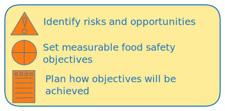

  

<a href="https://youtube.com/shorts/l05z6GTwNKM">

  
Watch on YouTube.
</a> 
 

Clause 6 requires the organization to plan actions to address risks and opportunities, set measurable food safety objectives, and plan how these objectives will be achieved. It also requires proper planning and control when making changes to the FSMS.

1. #####  Actions to address risks and opportunities
When planning for the FSMS, the organization shall consider the issues and the requirements to determine the risks and opportunities that need to be
addressed to:
- give assurance that the FSMS can achieve its intended result(s);
- enhance desirable effects
- prevent, or reduce, undesired effects;
- achieve continual improvement.
The organization shall plan:
- actions to address these risks and opportunities;
-  how to: integrate and implement the actions into its FSMS processes and 
  evaluate the effectiveness of these actions.
The actions taken by the organization to address risks and opportunities shall be proportionate to:
- the impact on food safety requirements;
- requirements of interested parties in the food chain.
-  the conformity of food products and services to customers;

2. #####  Objectives of the food safety management system and planning to achieve them
The organization shall establish objectives for the FSMS at relevant functions and levels.
The objectives of the FSMS shall:
- be consistent with the food safety policy;
- be measurable (if practicable);
- take into account applicable food safety requirements, including statutory,         regulatory and customer
  requirements;
- be monitored and verified;
- be communicated;
- be maintained and updated as appropriate.
- The organization shall retain documented information on the objectives for the FSMS.       
When planning how to achieve its objectives for the FSMS, the organization shall determine:
- what will be done;
- what resources will be required;
- who will be responsible;
- when it will be completed;
- how the results will be evaluated.

3. ##### Planning of changes
When the organization determines the need for changes to the FSMS, including personnel changes, the
changes shall be carried out and communicated in a planned manner.
The organization shall consider:
- the purpose of the changes and their potential consequences;
- the availability of resources to effectively implement the changes;
- the continued integrity of the FSMS;
- the allocation or re-allocation of responsibilities and authorities.
