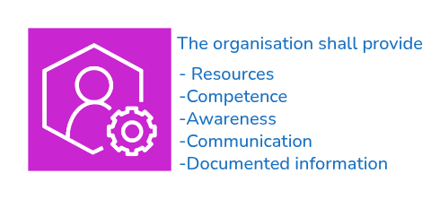

  
Clause 7 requires the organization to provide the necessary resources, competence, awareness, communication, and documented information needed to operate and maintain the Food Safety Management System effectively.
Following points are covered in the standard.

1. ##### Resources

   ***1.1 General***

      The organization shall determine and provide the resources needed for the establishment,implementation, maintenance, update and continual improvement of the FSMS.
      The organization shall consider:
      a. the capability of, and any constraints on, existing internal resources;
      b. the need for external resources.

   ***1.2 People***

      The organization shall ensure that persons necessary to operate and maintain an effective FSMS are competent .  
      here the assistance of external experts is used for the development, implementation, operation or assessment of the FSMS, evidence of agreement or contracts defining the competency, responsibility and authority of external experts shall be retained as documented information.
   
   ***1.3 Infrastructure***

      The organization shall provide the resources for the determination, establishment and maintenance of the infrastructure necessary to achieve conformity with the requirements of the FSMS.
      NOTE :Infrastructure can include:
      - land, vessels, buildings and associated utilities;
      - transportation;
      - equipment, including hardware and software;
      - information and communication technology.
  
   ***1.4 Work environment***

      The organization shall determine, provide and maintain the resources for the establishment,management and maintenance of the work environment necessary to achieve conformity with the requirements of the FSMS.
      NOTE
      A suitable environment can be a combination of human and physical factors such as:
      a. social (e.g. non-discriminatory, calm, non-confrontational);
      b. psychological (e.g. stress-reducing, burnout prevention, emotionally protective);
      c. physical (e.g. temperature, heat, humidity, light, air flow, hygiene, noise).These factors can differ substantially.  
   
   ***1.5 Externally developed elements of the food safety management system***

      When an organization establishes, maintains, updates and continually improves its FSMS by using externally developed elements of a FSMS, including PRPs, the hazard analysis and the hazard control plan, the organization shall ensure that the provided elements are:
      a. developed in conformance with requirements of this document;
      b. applicable to the sites, processes and products of the organization;
      c. specifically adapted to the processes and products of the organization by the food 
      d. implemented, maintained and updated as required by this document;
      safety team;
      e. retained as documented information.

   ***1.6 Control of externally provided processes, products or services***

      The organization shall:
      . establish and apply criteria for the evaluation, selection, monitoring of performance and re-evaluation of external providers of processes, products and/or services;
      b. ensure adequate communication of requirements to the external provider(s);
      c. ensure that externally provided processes, products or services do not adversely affect the organization's ability to consistently meet the requirements of the FSMS;
      d. retain documented information of these activities and any necessary actions as a result of the evaluations and re-evaluations.

2. ##### Competence

      The organization shall: 
      a. determine the necessary competence of person(s), including external providers, doing work under its control that affects its food safety performance and effectiveness of the FSMS;  
      b.  ensure that these persons, including the food safety team and those responsible for the operation of the hazard control plan, are competent on the basis of appropriate education, training and/or experience;
      c. ensure that the food safety team has a combination of multi-disciplinary knowledge and experience in developing and implementing the FSMS (including, but not limited to, the organization’s products,processes, equipment and food safety hazards within the scope of the FSMS);
      d. where applicable, take actions to acquire the necessary competence, and evaluate the effectiveness
      of the actions taken;  
      e.retain appropriate documented information as evidence of competence.
      NOTE
      Applicable actions can include, for example, the provision of training to, the mentoring of, or the re-
      assignment of currently employed persons; or the hiring or contracting of competent persons.

3. ##### Awareness

   The organization shall ensure that all relevant persons doing work under the organization’s control
   shall be aware of:
   a. the food safety policy;
   b. the objectives of the FSMS relevant to their task(s);
   c. their individual contribution to the effectiveness of the FSMS, including the benefits of improved
   food safety performance;
   d.  the implications of not conforming with the FSMS requirements.

4. ##### Communication

   1 *General*

   The organization shall determine the internal and external communications relevant to the FSMS, including:
   a- on what it will communicate;
   b- when to communicate;
   c- with whom to communicate;
   d- how to communicate;
   e- who communicates.
   The organization shall ensure that the requirement for effective communication is understood by all
   persons whose activities have an impact on food safety.
   
   2 *External communication*

   The organization shall ensure that sufficient information is communicated externally and is available
   for interested parties of the food chain.
   The organization shall establish, implement and maintain effective communications with:
   a-external providers and contractors;
   b- customers and/or consumers, in relation to:
   d- other organizations that have an impact on, or will be affected by, the effectiveness or updating of   the FSMS.
   1- product information related to food safety, to enable the handling, display, storage, preparation,
   distribution and use of the product within the food chain or by the consumer;
   2- identified foods safety hazards that need to be controlled by other organizations in the food
   chain and/or by consumers;
   3 *contractual arrangements, enquiries and orders, including their amendments*
   4 *customer and/or consumer feedback, including complaints;
   statutory and regulatory authorities;
  
   Designated persons shall have defined responsibility and authority for the external communication
   of any information concerning food safety. Where relevant, information obtained through external
   communication shall be included as input for management review (see 9.3) and for updating the FSMS

   Evidence of external communication shall be retained as documented information.

   3 *Internal communication*

   The organization shall establish, implement and maintain an effective system for communicating issues
   To maintain the effectiveness of the FSMS, the organization shall ensure that the food safety team is
   informed in a timely manner of changes in the following:
   a-products or new products;
   c-  Complaints and alerts indicating food safety hazards associated with      the  end product;
   c-production systems and equipment;
   d- production premises, location of equipment and surrounding environment;
   e-cleaning and sanitation programmes;
   f-raw materials, ingredients and services;    
   packaging, storage and distribution systems;
   g-competencies and/or allocation of responsibilities and authorizations;
   h- applicable statutory and regulatory requirements;
   -knowledge regarding food safety hazards and control measures;
   -Customer, sector and other requirements that the organization observes;
   k- relevant enquiries and communications from external interested parties;
   l- 
   m- other conditions that have an impact on food safety.
   he food safety team shall ensure that this information is included when updating the FSMS 
  
   Top management shall ensure that relevant information is included as input to the management review
  
5. ##### Documented information

   *General*

   The organization’s FSMS shall include:
   a-documented information required by this document;
   b- documented information determined by the organization as being necessary for the effectiveness of the FSMS;
   c-documented information and food safety requirements required by statutory, regulatory
   authorities and customers.
   —the size of organization and its type of activities, processes, products and services;
   —the competence of persons.

   NOTE:    
   The extent of documented information for a FSMS can differ from one organization to another due to:
   the complexity of processes and their interactions;
 
   *Creating and updating*

   When creating and updating documented information, the organization shall ensure appropriate: 
   a-identification and description (e.g. a title, date, author, or reference number);
   b- format (e.g. language, software version, graphics) and media (e.g. paper, electronic);
   c-review and approval for suitability and adequacy.  

   *Control of documented information*
   
    Documented information required by the FSMS and by this document shall be controlled to
   ensure:
   a- it is available and suitable for use, where and when it is needed;
   b- it is adequately protected (e.g. from loss of confidentiality, improper use, or loss of integrity).
    For the control of documented information, the organization shall address the following
   activities, as applicable:
   a-distribution, access, retrieval and use;
   c-control of changes (e.g. version control);
   b- storage and preservation, including preservation of legibility;
   d- retention and disposition.
   Documented information of external origin determined by the organization to be necessary for the
   planning and operation of the FSMS shall be identified, as appropriate, and controlled.
   Documented information retained as evidence of conformity shall be protected from unintended
   alterations.

  