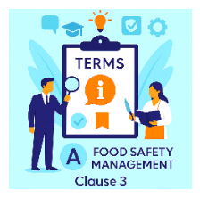

For the purposes of this standard, the following terms and definitions apply.

1.  ##### Acceptable level
Level of a food safety hazard not to be exceeded in the end product provided by the organization.

2.  ##### Action criterion
Measurable or observable specification for the monitoring of an OPRP.

3.  ##### Audit
Systematic, independent and documented process to obtain audit evidence and evaluate it objectively against criteria.

4.  ##### Competence
Ability to apply knowledge and skills to achieve intended results.

5.  ##### Conformity
Fulfilment of a requirement.

6.  ##### Contamination
Introduction or occurrence of a contaminant, including a food safety hazard, in a product or environment.

7.  ##### Continual improvement
Recurring activity to enhance performance.

8.  ##### Control measure
Action or activity essential to prevent a significant food safety hazard or reduce it to an acceptable level.

9.  ##### Correction
Action to eliminate a detected nonconformity.

10.  ##### Corrective action
Action to eliminate the cause of a nonconformity and prevent recurrence.

11.  ##### Critical control point (CCP)
Step where control measures are applied to prevent or reduce a significant hazard to an acceptable level.

12.  ##### Critical limit
Measurable value separating acceptability from unacceptability.

13.  ##### Documented information
Information required to be controlled and maintained, including the medium where it is stored.

14.  ##### Effectiveness
Extent to which planned activities and results are achieved.

15.  ##### End product
Product that undergoes no further processing by the organization.

16.  ##### Feed
Product intended to be fed to food-producing animals.

17.  ##### Flow diagram
Schematic representation of the sequence and interactions of process steps.

18.  ##### Food
Substance intended for human consumption including beverages, chewing gum and ingredients.

19.  ##### Animal food
Product intended for non-food-producing animals.

20.  ##### Food chain
Sequence of stages involved in the production, processing and distribution of food from source to consumption.

21.  ##### Food safety
Assurance that food will not cause adverse health effects when consumed as intended.

22.  ##### Food safety hazard
Biological, chemical or physical agent with potential to cause adverse health effects.

23.  ##### Interested party (stakeholder)
Person or organization that can affect, be affected by, or see themselves affected by decisions or activities.

24.  ##### Lot
Defined quantity of product produced under the same conditions.

25.  ##### Management system
Set of elements used to establish policies, objectives and processes.

26.  ##### Measurement
Process to determine a value.

27.  ##### Monitoring
Observation or measurement to determine status of a system, process or activity.

28.  ##### Nonconformity
Non-fulfilment of a requirement.

29.  ##### Objective
Result to be achieved.

30.  ##### Operational prerequisite programme (OPRP)
Control measure essential to control a significant hazard where measurement or observation confirms effectiveness.

31.  ##### Organization
Person or group with responsibilities and authority to achieve objectives.

32.  ##### Outsource
Use of an external organization to perform part of a function or process.

33.  ##### Performance
Measurable result.

34.  ##### Policy
Intentions and direction of an organization as formally expressed by top management.

35.  ##### Prerequisite programme (PRP)
Basic conditions and activities needed to maintain a hygienic environment.

36.  ##### Process
Set of activities that transform inputs into outputs.

37.  ##### Product
Output of a process.

38.  ##### Requirement
Need or expectation that is stated, implied or obligatory.

39.  ##### Risk
Effect of uncertainty.

40.  ##### Significant food safety hazard
Hazard requiring control to ensure food safety.

41.  ##### Top management
Group or person directing and controlling the organization at the highest level.

42.  ##### Traceability
Ability to track the history, movement or location of an item.

43.  ##### Update
Activity to ensure current and relevant information is applied.

44.  ##### Validation
Evidence showing that a control measure will effectively control a hazard.

45.  ##### Verification
Confirmation that requirements have been fulfilled.
